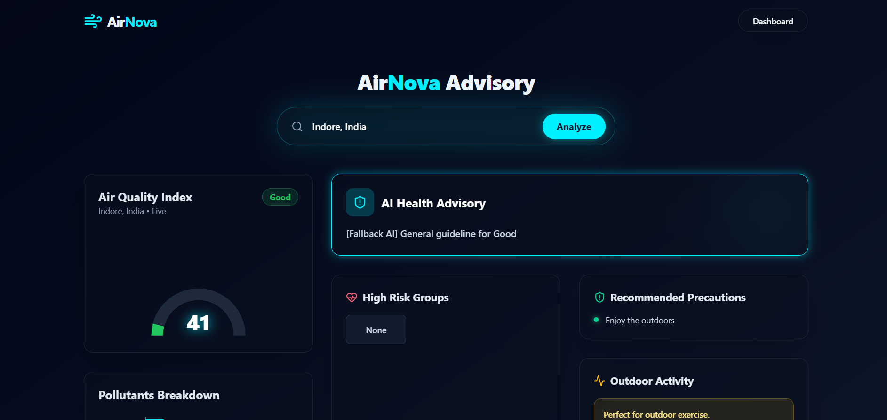
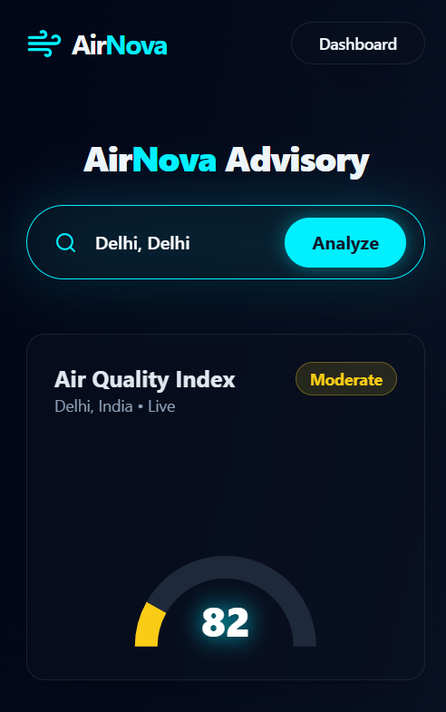
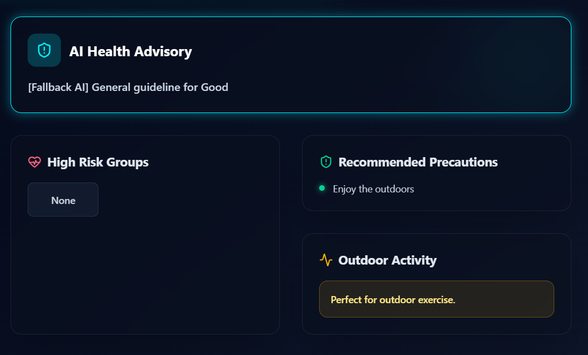
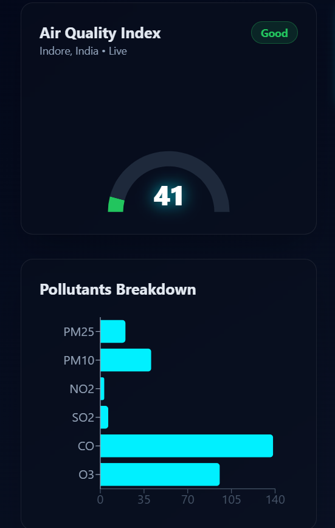

<div align="center">

# 🌍 AirNova
### AI-Based Real-Time AQI Monitoring & Intelligent Health Advisory System

<p align="center">
An Academic Mini Project developed to provide intelligent real-time air quality monitoring and AI-driven health recommendations for Indian cities.
</p>

</div>

---

# 📖 Project Overview

AirNova is an AI-powered web application designed to monitor real-time Air Quality Index (AQI) levels and provide intelligent health advisories based on pollution conditions. The system converts complex AQI data into simple, understandable, and actionable health insights using Artificial Intelligence and Retrieval-Augmented Generation (RAG).

The project focuses on increasing public awareness about air pollution and helping users understand the health impacts of different AQI levels. AirNova also provides precautionary measures, identifies vulnerable groups, and recommends whether outdoor activities are safe based on current pollution conditions.

This project was developed as an academic mini project under the Department of Computer Science & Engineering at Medicaps University.

---

# 🚀 Technology Stack & Tools Used

## 💻 Frontend Technologies
- React.js
- HTML5
- CSS3
- JavaScript

## ⚙️ Backend Technologies
- Node.js
- Express.js

## 🗄️ Database
- MongoDB 

## 🤖 AI & API Integration
- Python
- Retrieval-Augmented Generation (RAG)
- AQI APIs
- OpenWeather API
- OpenAQ API

## 🛠️ Development Tools & Platforms
- VS Code
- Git & GitHub
- Postman
- Render
- Vercel

---

# ✨ Features & Functionalities

✅ Real-Time AQI Monitoring System  
✅ Live AQI API Integration  
✅ AQI Classification Module  
✅ AI-Based Health Advisory Generation  
✅ Identification of High-Risk Groups  
✅ Outdoor Activity Recommendations  
✅ Health Precaution Suggestions  
✅ Interactive & Responsive Dashboard  
✅ User-Friendly Interface  
✅ Cloud Deployment Support  
✅ Secure API Handling  

---

# 📊 AQI Classification Standards

| AQI Range | AQI Category | Health Concern Level |
|-----------|--------------|----------------------|
| 0 – 50 | Good | Minimal Impact |
| 51 – 100 | Moderate | Acceptable |
| 101 – 200 | Poor | Unhealthy for Sensitive Groups |
| 201 – 300 | Very Poor | Significant Health Effects |
| 301+ | Severe | Serious Health Risk |

---

# ⚙️ Installation & Execution Steps

## 1️⃣ Clone the Repository

```bash
git clone https://github.com/your-github-username/airnova.git
cd airnova
```

---

## 2️⃣ Install Frontend Dependencies

```bash
cd frontend
npm install
```

---

## 3️⃣ Install Backend Dependencies

```bash
cd backend
npm install
```

---

## 4️⃣ Configure Environment Variables

Create a `.env` file inside the backend directory and add the following:

```env
PORT=5000
MONGO_URI=your_database_url
AQI_API_KEY=your_api_key
JWT_SECRET=your_secret_key
```

---

## 5️⃣ Run Backend Server

```bash
npm start
```

OR

```bash
nodemon server.js
```

---

## 6️⃣ Run Frontend Application

```bash
npm run dev
```

OR

```bash
npm start
```

---

## 7️⃣ Open Application in Browser

```bash
http://localhost:3000
```

---

# 🔄 System Workflow

1. User enters city/location details  
2. System fetches live AQI data through APIs  
3. AQI values are analyzed and categorized  
4. AI module generates health advisories  
5. Dashboard displays:
   - AQI Levels
   - Pollution Category
   - Health Effects
   - Vulnerable Risk Groups
   - Precautionary Measures
   - Outdoor Activity Recommendations

---

# 📷 Project Screenshots / Output

## 🏠 Home Dashboard

Displays real-time AQI information with pollution indicators and interactive visualization.



---

## 🤖 AI-Based Health Advisory System

Generates intelligent health recommendations according to AQI levels.



---

## 🌤 AQI Monitoring Panel

Shows AQI categories, pollutant information, and safety recommendations.



---

## 📱 Responsive User Interface

Responsive design for desktop and mobile devices.



---

# 👩‍💻 Team Members

| Name | Enrollment Number |
|------|-------------------|
| Aditi Verma | EN23CS301062 |
| Akanksha Mishra | EN23CS301084 |
| Aditya Bhati | EN23CS301064 |

---

# 🎯 Objectives of the Project

- To monitor real-time AQI data for Indian cities
- To classify pollution levels into standard AQI categories
- To generate AI-based health advisories
- To provide safety precautions and health recommendations
- To improve public awareness regarding air pollution
- To assist users in making safer outdoor activity decisions

---

# 🔒 Security & Reliability

- Secure API Key Handling
- Protected Backend Configuration
- Error Handling & API Validation
- Scalable Cloud Deployment Support

---

# 🌟 Future Enhancements

🚀 AQI Prediction using Machine Learning Models  
🚀 Personalized User Health Profiles  
🚀 Notification & Alert System  
🚀 Historical AQI Analytics  
🚀 Multi-language Support  
🚀 Mobile Application Development  

---

# 📚 References

1. World Health Organization (WHO) – Air Quality Guidelines  
2. Central Pollution Control Board (CPCB), India  
3. OpenAQ API Documentation  
4. AirNow API Documentation  
5. Environmental Protection Agency (EPA) Standards  

---

# 👨‍🏫 Project Guidance

### Guided By:
- Prof. Garima Tukra 
- Prof. Swati Vaidya  

Department of Computer Science & Engineering  
Medicaps University, Indore

---

# 📄 License

This project is developed strictly for academic and educational purposes.

---
